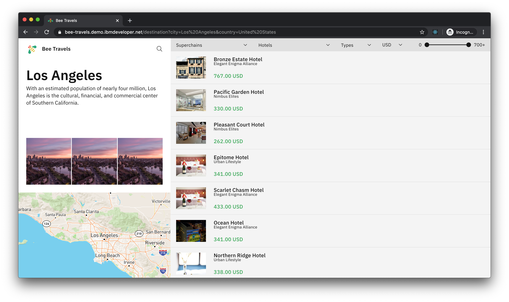
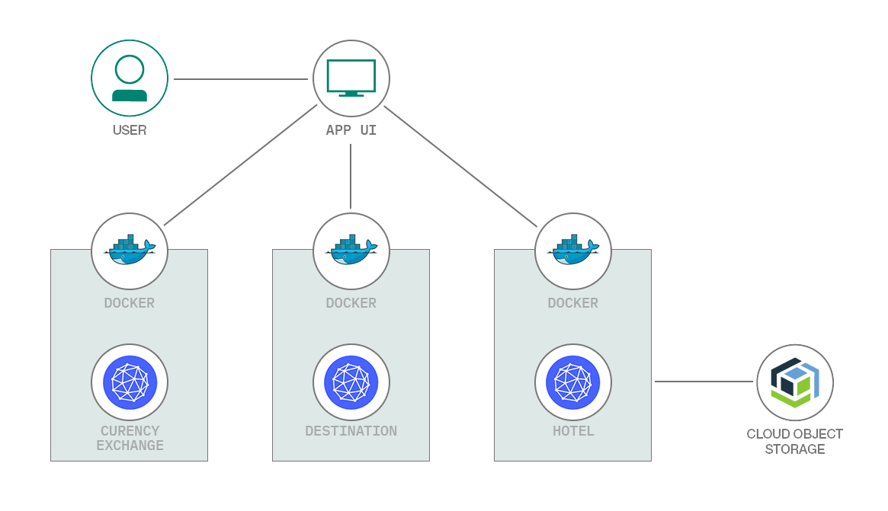

<p align='center'>

</p>

# Bee Travels — Node.js [](https://travis-ci.org/bee-travels/bee-travels-node)

> **Note:** Bee Travels is a work in progress. This document will be updated to reflect any changes.



## About

Bee Travels is a polyglot microservice demo in the form of a travel agency web application.
This repo is home to the Node.js version of bee travels.
To see versions of Bee Travels for other languages, check out the [Bee Travels GitHub org](https://github.com/bee-travels).

This application is used to demonstrate key capabilities of Kubernetes, Openshift, Istio, Knative and many other cloud native applications.
It also uses best practices in the software development lifecycle and wildly used open source technologies.

## Basic Usage
### Setup
`git clone` the repo and `cd` into it by running the following command:
```bash
git clone https://github.com/bee-travels/bee-travels-node.git
cd bee-travels-node
```

This project uses `Yarn 2`, if you don't already have it installed, install it globally with:
```
npm install -g yarn
```

> **Note: You’ll need to have Node v10+ on your local development machine.** You can use [nvm](https://github.com/creationix/nvm#installation) (macOS/Linux) or [nvm-windows](https://github.com/coreybutler/nvm-windows#node-version-manager-nvm-for-windows) to easily switch Node versions between different projects.

### Run Bee Travels

```bash
yarn start
```

> **Note:** This will start every microservice.
> To exclude a microservice run `yarn start --exclude <service>`.
> To run a single microservice `cd` into it's directory and run `yarn start` or simply run `yarn workspace <service> run start`.

### (Optional) Run Bee Travels with Docker Compose
#### Prerequisites
* [Docker for Desktop](https://www.docker.com/products/docker-desktop)

```bash
docker-compose up --build
```

### (Optional) Deploy to Cloud
Bee Travels currently supports deploying to cloud using the following configurations:
* Helm
* Kubernetes
* Knative
* OpenShift

For instructions on deploying Bee Travels to cloud, check out the [config](https://github.com/bee-travels/config/) repo.


## Key Components/Technologies Used

The following are key components/technologies used with the Node.js version of Bee Travels:

* Package Management
  * [Yarn 2](https://yarnpkg.com/)
* Web Framework
  * [Express](https://expressjs.com/)
* Front End
  * [React](https://reactjs.org/)
  * [Create React App](https://create-react-app.dev/)
  * [Carbon Design System](https://www.carbondesignsystem.com/)
  * [Material-UI](https://material-ui.com/)
* API Definition
  * [Swagger](https://github.com/scottie1984/swagger-ui-express/)
* Image Database
  * [IBM Cloud Object Storage](https://cloud.ibm.com/docs/cloud-object-storage/)
* Testing
  * [Mocha](https://mochajs.org/) (Test Runner)
  * [Chai](https://www.chaijs.com/) (Assertion Library)
  * [Sinon](https://sinonjs.org/) (Spies & Mocks)
  * [Istanbul/nyc](https://istanbul.js.org/) (Coverage)
* Code Quality
  * [ESLint](https://eslint.org/)
  * [Prettier](https://prettier.io/)
* ECMA Support
  * [ESM](https://github.com/standard-things/esm/)
* CI/CD
  * [Travis CI](https://travis-ci.com/)
* Logging
  * [Pino](https://github.com/pinojs/express-pino-logger/)
* Containerization
  * [Docker](https://www.docker.com/)

## Architecture

Bee Travels is a travel booking application that is composed of several mircoservices.
Each mircoservice can be run independently, or together to form the full service.
Bee Travels can be used to search and book hotels, flights and car rentals for various destinations across the world.
> **Note:** All data is fake and only to be used for demonstration purposes.

Bee Travels is comprised of the following microservices:
* [UI Frontend](services/ui/frontend)
* [UI Backend](services/ui/backend)
* [Destination Service](services/destination)
* [Hotel Service](services/hotel)
* [Currency Exchange](services/currency-exchange)

### Architecture Diagram

The following is a basic architecture diagram for the containerized version of Bee Travels.
Depending on how you run this application, the architecture diagram will look slightly different.

<p align='center'>

</p>

## License

This application is licensed under the Apache License, Version 2. Separate third-party code objects invoked within this application are licensed by their respective providers pursuant to their own separate licenses. Contributions are subject to the [Developer Certificate of Origin, Version 1.1](https://developercertificate.org/) and the [Apache License, Version 2](https://www.apache.org/licenses/LICENSE-2.0.txt).

[Apache License FAQ](https://www.apache.org/foundation/license-faq.html#WhatDoesItMEAN)
