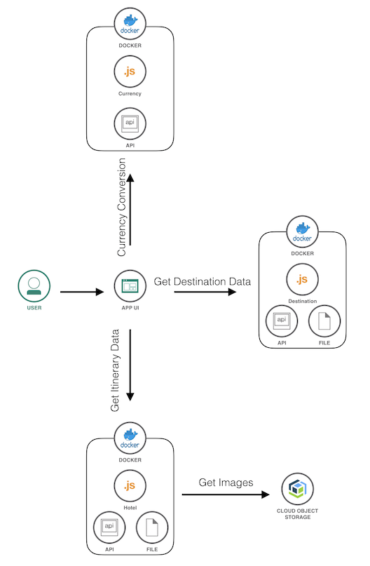

# Bee Travels - Node.js

[](https://travis-ci.org/bee-travels/bee-travels-node)

> ***NOTE:*** Bee Travels is a work in progress and this README will update as progress is made


## About

Bee Travels in a polyglot demo microservice travel booking web application with this repo housing the Node.js Express version. To view the versions of Bee Travels written in other languages, check out the [Bee Travels project](https://github.com/bee-travels).

This application is used to demonstrate key capabilities of Kubernetes, Opneshift, Istio, Knative and many other cloud native applications. It also uses best practices in the software development lifecycle and widley used open source technologies.

### Key Components/Technologies Used

The following are key components/technologies used with the Node.js version of Bee Travels:

* Web Framework
	* [Express](https://expressjs.com/)
* Front End
	* [React](https://reactjs.org/)
	* [Carbon Design System](https://www.carbondesignsystem.com/)
* API Definition
	* [Swagger](https://github.com/scottie1984/swagger-ui-express)
* Image Database
	* [IBM Cloud Object Storage](https://www.ibm.com/cloud/object-storage)
* Testing
	* Unit Testing
		* [Jest](https://github.com/facebook/jest)
	* Integration Testing
* Code Quality
	* [ESLint](https://eslint.org/)
	* [Prettier](https://prettier.io/)
	* [Husky](https://github.com/typicode/husky)
	* [ESM](https://github.com/standard-things/esm)
* CI/CD
	* [Travis CI](https://travis-ci.com/)
* Logging
	* [Pino](https://github.com/pinojs/express-pino-logger)
* Containerization
	* [Docker](https://www.docker.com/)
		* [Bee Travels Repo](https://hub.docker.com/orgs/beetravels/repositories)

### Architecture

Bee Travels is a travel booking application that is composed of different mircoservices that can all run independently of one another or together to form Bee Travels. The application can be used to search and book hotels for various destinations across the world.
> ***NOTE:*** All data being used is made up and used for the purpose of this demo application

Bee Travels is comprised of the following microservices:
* [Front End/UI](src/ui)
* [Destinations](src/destination)
* [Hotel](src/hotel)
* [Currency Exchange](src/currencyexchange)

#### Architecture Diagram

The following is a basic architecture diagram for the containerized version 1 (v1) of Bee Travels. Depending on how you run this application, the architecture diagram will look slightly different.



#### Screenshot


## How to Run

* [Local with no containers](#local-with-no-containers)
* [Local with containers](#local-with-containers)
* [Deploy to the Cloud](#deploy-to-the-cloud)

### Local with no containers

#### Prerequisites

* [NPM](https://www.npmjs.com/get-npm)
* [Node.js v10+](https://nodejs.org/en/download/)

#### Steps
> ***NOTE:*** For running microservices independently, read the instructions in each microservice's README in `/src`

```sh
git clone https://github.com/bee-travels/bee-travels-node.git
cd bee-travels-node
./run-all.sh
```

### Local with containers

#### Prerequisites

* [Docker for Desktop](https://www.docker.com/products/docker-desktop)

#### Steps

```bash
git clone https://github.com/bee-travels/bee-travels-node
cd bee-travels-node
docker-compose up --build
```

### Deploy to the Cloud

Bee Travels currently supports deploying to the Cloud using the following configurations:

* Helm
* K8s
* Knative

For instructions on how to deploy Bee Travels to the Cloud, check out the [config](https://github.com/bee-travels/config) repo for the Bee Travels project.

## License

This application is licensed under the Apache License, Version 2. Separate third-party code objects invoked within this application are licensed by their respective providers pursuant to their own separate licenses. Contributions are subject to the [Developer Certificate of Origin, Version 1.1](https://developercertificate.org/) and the [Apache License, Version 2](https://www.apache.org/licenses/LICENSE-2.0.txt).

[Apache License FAQ](https://www.apache.org/foundation/license-faq.html#WhatDoesItMEAN)