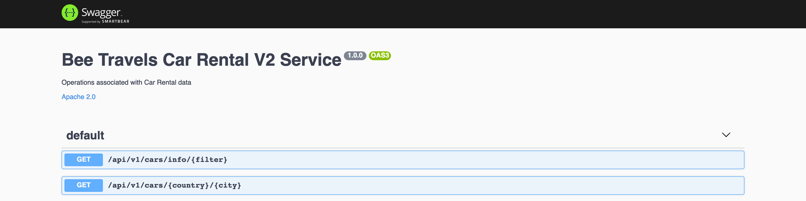

# Bee Travels Car Rental V2 Service - Node.js

The car rental service is a microservice designed to provide information about various car rental locations for the Bee Travels travel application.

## Data
> ***NOTE:*** All data being used is made up and used for the purpose of this demo application

The car rentals used consist of the following data for various destination locations around the world:

* Car ID
* Car Rental Company
* Car name
* Car body type
* Car style
* Cost
* Images of the car ([Hosted on IBM Cloud Cloud Object Storage](https://www.ibm.com/cloud/object-storage))

The source of the car rental service data is provided from a database. The following databases are currently supported: MongoDB, PostgreSQL, Cloudant, and CouchDB. Check out [this](https://github.com/bee-travels/data-generator/tree/master/src/hotels) for more info on data generation and populating a database with car rental data.

## Environment Variables

* `CAR_DATABASE` - ***REQUIRED*** variable for type of database to be used. The following are acceptable values:
  * `mongodb`
  * `postgres`
  * `cloudant`
  * `couchdb`
* `MONGO_CONNECTION_URL` - variable for the Mongo database connection URL

## APIs

Swagger can be accessed at the `/api-docs` endpoint



## Basic Usage

* [Run](#run)
* [Test](#test)
* [Deploy to the Cloud](#deploy-to-the-cloud)

To use the car rental service navigate to the `car-rental-v2` directory:

```bash
git clone https://github.com/bee-travels/bee-travels-node
cd services/car-rental-v2/
```

### Run

The car rental service runs on port `9102`

#### Local without container

```bash
yarn start
```

#### Local with container

```bash
docker build -t beetravels-node-car-rental-v2 .
docker run -it beetravels-node-car-rental-v2
```

### Test

```bash
yarn test
```

### Deploy to the Cloud

Bee Travels currently supports deploying to the Cloud using the following configurations:

* Helm
* K8s
* OpenShift

For instructions on how to deploy the car rental service to the Cloud, check out the [config](https://github.com/bee-travels/config) repo for the Bee Travels project.
