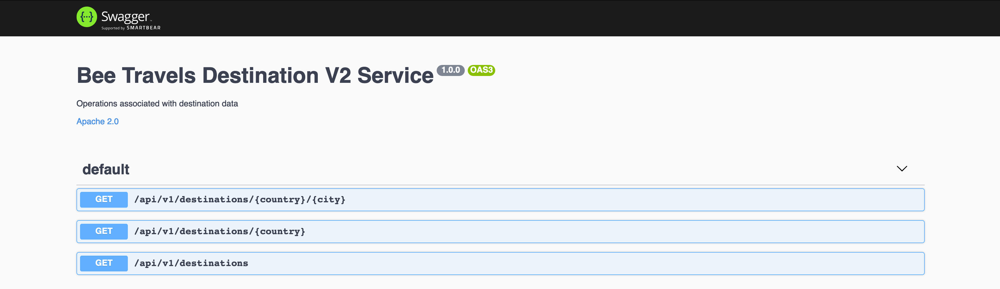

# Bee Travels Destination V2 Service - Node.js

The destination service is a microservice designed to provide information about various destination locations for the Bee Travels travel application.

## Data
> ***NOTE:*** All data being used is made up and used for the purpose of this demo application

The destination cities used are a subset of cities with a population over 1 million people and consists of the following data for various destination locations around the world:

* City ID
* City name
* Latitude
* Longitude
* Country
* Population
* Description about the city
* Images of the city ([Hosted on IBM Cloud Cloud Object Storage](https://www.ibm.com/cloud/object-storage))

The source of the destination service data is provided from a database. The following databases are currently supported: MongoDB, PostgreSQL, Cloudant, and CouchDB. Check out [this](https://github.com/bee-travels/data-generator/tree/master/src/destination) for more info on data generation and populating a database with destination data.

## Environment Variables

* `DATABASE` - ***REQUIRED*** variable for type of database to be used. The following are acceptable values:
  * `mongodb`
  * `postgres`
  * `cloudant`
  * `couchdb`
* `MONGO_CONNECTION_URL` - variable for the `mongodb` database connection URL
* `COUCH_CLOUDANT_CONNECTION_URL` - variable for the `couchdb` or `cloudant` database connection URL
* `PG_HOST` - variable for the `postgres` database host
* `PG_PORT` - variable for the `postgres` database port
* `PG_USER` - variable for the `postgres` database user
* `PG_PASSWORD` - variable for the `postgres` database password
* `DATABASE_CERT` - variable for the CA certificate used to connect to a database if TLS/SSL is used

## APIs

Swagger can be accessed at the `/api-docs` endpoint



## Basic Usage

* [Run](#run)
* [Test](#test)
* [Deploy to the Cloud](#deploy-to-the-cloud)

To use the car rental service navigate to the `destination-v2` directory:

```bash
git clone https://github.com/bee-travels/bee-travels-node
cd services/destination-v2/
```

### Run

The car rental service runs on port `9001`

#### Local without container

```bash
yarn start
```

#### Local with container

```bash
docker build -t beetravels-node-destination-v2 .
docker run -it beetravels-node-destination-v2
```

### Test

```bash
yarn test
```

### Deploy to the Cloud

Bee Travels currently supports deploying to the Cloud using the following configurations:

* Helm
* K8s
* OpenShift

For instructions on how to deploy the car rental service to the Cloud, check out the [config](https://github.com/bee-travels/config) repo for the Bee Travels project.
