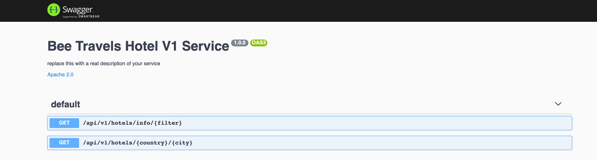

# Bee Travels Hotel V1 Service - Node.js

The hotel service is a microservice designed to provide information about various hotel locations for the Bee Travels travel application.

## Data
> ***NOTE:*** All data being used is made up and used for the purpose of this demo application

The hotels used consist of the following data for various destination locations around the world:

* Hotel ID
* Hotel superchain
* Hotel name
* Hotel type
* Cost
* Images of the hotel ([Hosted on IBM Cloud Cloud Object Storage](https://www.ibm.com/cloud/object-storage))

The source of the hotel service data is provided from local files. Check out [this](https://github.com/bee-travels/data-generator/tree/master/src/hotels) for more info on data generation for hotel data.

## APIs

Swagger can be accessed at the `/api-docs` endpoint



## Basic Usage

* [Run](#run)
* [Test](#test)
* [Deploy to the Cloud](#deploy-to-the-cloud)

To use the hotel service navigate to the `hotel-v1` directory:

```bash
git clone https://github.com/bee-travels/bee-travels-node
cd services/hotel-v1/
```

### Run

The hotel service runs on port `9101`

#### Local without container

```bash
yarn start
```

#### Local with container

```bash
docker build -t beetravels-node-hotel-v1 .
docker run -it beetravels-node-hotel-v1
```

### Test

```bash
yarn test
```

### Deploy to the Cloud

Bee Travels currently supports deploying to the Cloud using the following configurations:

* Helm
* K8s
* OpenShift

For instructions on how to deploy the hotel service to the Cloud, check out the [config](https://github.com/bee-travels/config) repo for the Bee Travels project.
