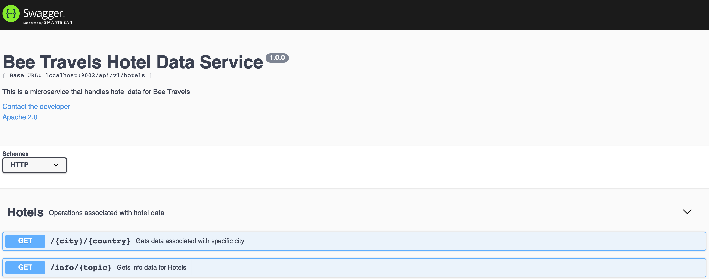

# Bee Travels Hotel Service - Node.js

The hotel service is a microservice designed to provide information about various hotel locations for the Bee Travels travel application.

## Data
> ***NOTE:*** All data being used is made up and used for the purpose of this demo application

The hotels used consists of the following data for various destination locations around the world:

* Superchain
* Name
* Type (luxury, comfort, budget)
* Cost
* Images of the hotel ([Hosted on IBM Cloud Cloud Object Storage](https://www.ibm.com/cloud/object-storage))

## APIs



## How to Run

* [Local with no containers](#local-with-no-containers)
* [Local with containers](#local-with-containers)
* [Deploy to the Cloud](#deploy-to-the-cloud)

### Local with no containers

#### Prerequisites

* [NodeJS v10+](https://nodejs.org/en/download/)
* [NPM](https://www.npmjs.com/get-npm)

#### Steps

```bash
git clone https://github.com/bee-travels/bee-travels-node
cd src/hotel
npm install
npm start
```

In a browser, go to `localhost:9002` to interact with the hotel service APIs in the swagger.

### Local with containers

#### Prerequisites

* [Docker for Desktop](https://www.docker.com/products/docker-desktop)

#### Steps

```bash
git clone https://github.com/bee-travels/bee-travels-node
cd src/hotel
docker build -t beetravels-node-hotel .
docker run -it beetravels-node-hotel
```

In a browser, go to `localhost:9002` to interact with the hotel service APIs in the swagger.

### Deploy to the Cloud

Bee Travels currently supports deploying to the Cloud using the following configurations:

* Helm
* K8s
* Knative

For instructions on how to deploy the hotel service to the Cloud, check out the [config](https://github.com/bee-travels/config) repo for the Bee Travels project.